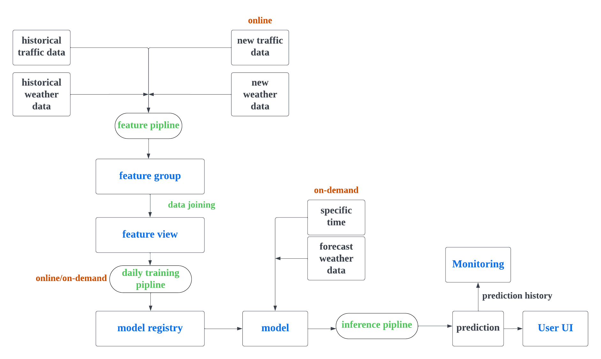

# Real-time traffic flow prediction

## Contributors: Jingyuan Han (19990320T490); 

## About
This project aims to build a real-time traffic flow predictor for the location [59°20'55.7"N 18°04'22.9"E](https://www.google.com/maps/place/59%C2%B020'55.7%22N+18%C2%B004'22.9%22E/@59.34881,18.0704451,17z/data=!3m1!4b1!4m4!3m3!8m2!3d59.34881!4d18.07302?authuser=0&entry=ttu) at KTH. Prediction of traffic flow at specific hour could be made based on the given time and weather conditions via [Hugging face](https://huggingface.co/spaces/Han760/Traffic_flow_prediction). The prediction model is also trained hourly using the real-time weather and traffic flow data, in order to improve the model performance consistently.

## Tools
Hopsworks (as the feature store);

Modal (to deploy daily piplines);

Hugging face (inference and monitoring UI)

## Project architecture

## Data source and feature pipline
The historical datasets were collected manually via [TomTom traffic flow api](https://developer.tomtom.com/traffic-api/documentation/traffic-flow/flow-segment-data) and [SMHI weather api](https://opendata-download-metanalys.smhi.se/mesan1gv2). We collected the traffic flow data and weather data of several days as the historical dataset to train the initial models. After the training was finished, we collect hourly new data from both sources and upload it to the hopsworks feature groups. ("hourly_traffic_feature_pipline.py", "hourly_weather_feature_pipline.py") This was automatically done on [Modal](https://modal.com/)

Here we used the follow data:
* Traffic flow data every hour
* Air temperature
* Wind direction
* Wind Speed
* Precipation last hour
* Snow precipation last hour
* Horizontal visibility

## Training pipline
In the [training pipeline](https://github.com/FlyingFish760/ID2223_project/blob/main/daily-training-pipeline.py), four ML models have been trained: K-Nearest Neighbors (KNN), Linear Regression, AdaBoost Regression, and XGBoost with RMSE and R2 Score to evaluate the performance of each model. The training pipeline is deployed as a scheduled job that runs every two hours on Modal, automating the model training and evaluation process. Then the best-performing model is identified based on performance and will be registered and uploaded to Hopsworks after every training. Also, plots comparing true values with predicted values for each model will also be uploads to Hopsworks using the Dataset API.

The training data is a combination of historical dataset and real-time collected traffic and weather data obtained from Hopsworks feature groups ("hourly_traffic_feature_pipline.py", "hourly_weather_feature_pipline.py"). The test data is sourced from combining traffic and weather data collected on a certain date for evaluation. 

## Inference pipline
The inference pipline could make real-time prediction of the traffic flow given a specific hour and weather conditions. Here the best model (based on the performance evaluation so far) was used, which was retrieved from the hopsworks model registry. The process is done via "gradio" interface built on [hugging face](https://huggingface.co/). Every prediction is also uploaded to the hopsworks. On another hugging face interface one could easily get the most recent 5 predictions. 

## UI
* [Inference UI](https://huggingface.co/spaces/Han760/Traffic_flow_prediction)
* [Monitor UI](https://huggingface.co/spaces/Han760/traffic_prediction_monitor)
